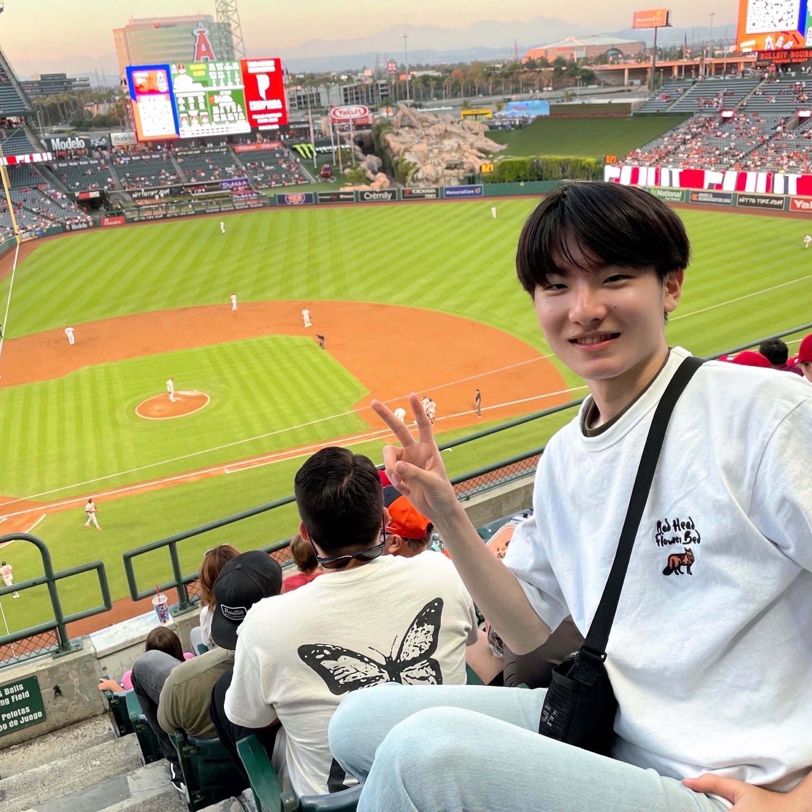

# 野々村 奏 (Nonomura Kanade)

* 所属：愛媛大学 大学院理工学研究科 自然言語処理研究室 修士1年
* Email：nonomura@ai.cs.ehime-u.ac.jp 

 

## 研究分野
* 自然言語処理
* 表現学習
* 自動プロンプト最適化

## 国際学会
* <u>Kanade Nonomura</u>, Keita Fukushima, Risa Kondo, Tomoyuki Kajiwara  
    Disentangling Meaning and Language Components in Diverse Multilingual Sentence Embeddings  
    In Proceedings of the ACL 2026 Student Research Workshop (ACL SRW 2026), pp.xxx-xxx, July 2026 (to appear)

* Yuko Toda, Daisuke Maekawa, Kota Manabe, Eito Yoneyama, <u>Kanade Nonomura</u>, Yuki Fujiwara, Tomoyuki Kajiwara  
    HOTATE: A Japanese Dialogue Corpus Annotated with Responses of Private Thoughts and Public Statements  
    In Proceedings of the 15th International Conference on Language Resources and Evaluation (LREC 2026), pp.xxx-xxx, Mallorca, Spain, May 2026 (to appear)

## 国内学会
* <u>野々村奏</u>, 福島 啓太, 近藤 里咲, 梶原 智之  
    多様な多言語文埋め込みに対する意味要素と言語要素の分離  
    人工知能学会第40回年次大会, pp.xxx-xxx, June 2026 (to appear)

* 戸田 裕子, 前川 大輔, 眞鍋 光汰, 米山 瑛人, <u>野々村 奏</u>, 藤原 有希, 梶原 智之  
    HOTATE：本音と建前の応答対からなる対話コーパスの構築  
    言語処理学会第32回年次大会, pp.1748-1752, March 2026

* <u>野々村 奏</u>, 福島 啓太, 近藤 里咲, 梶原 智之  
    多言語文埋め込みの意味と言語の分離のための損失関数の分析  
    言語処理学会第32回年次大会, pp.3842-3846, March 2026

* <u>野々村奏</u>, 梶原智之  
    日本語文埋め込み獲得のための大規模言語モデルのプロンプト設計  
    情報処理学会第88回全国大会, pp.281-282, March 2026

* <u>野々村 奏</u>, 近藤 里咲, 梶原 智之  
    多言語文埋め込みの意味要素と言語要素の分離に関する調査  
    NLP若手の会第20回シンポジウム (YANS2025), September 2025

## 受賞
* 情報処理学会第88回全国大会 学生奨励賞 
  > <u>野々村奏</u>, 梶原智之  
  > 日本語文埋め込み獲得のための大規模言語モデルのプロンプト設計  
  > 情報処理学会第88回全国大会, pp.281-282, March 2026 (to appear)
* 応用情報技術者試験 合格
* 愛媛大学工学部工学科応用情報工学コース優秀学生（3 年次） 受賞

## インターン
* 株式会社レトリバ, February 9, 2026 to March 31, 2026 [[link](https://zenn.dev/retrieva_tech/articles/b5c21fe10e4ee9)]

## その他
* 【技育CAMP2026】ハッカソン Vol.2 参加中 [[link](https://talent.supporterz.jp/events/82c4c266-cde5-4b34-90fe-7c82d83a97dc/)]
* 第20回言語処理若手シンポジウム(2025) ハッカソン 参加 [[link](https://yans.anlp.jp/entry/yans2025hackathon)]
* 【技育CAMP2025】ハッカソン Vol.8 参加 [[link](https://talent.supporterz.jp/events/cbcbae79-19d7-4ae3-a45c-75b8bb80a562/)]
* Ruby 合宿 2024 夏 参加 [[link](https://www.rubycamp.jp/reports/2024-08-31-2024-summer/)]

